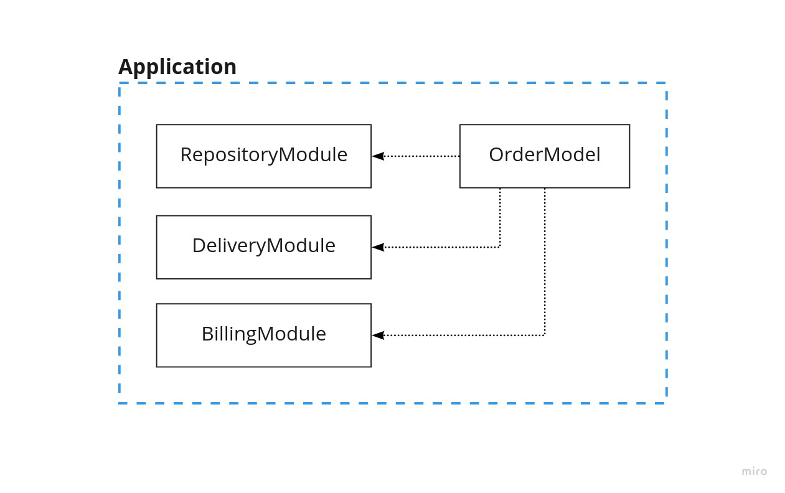
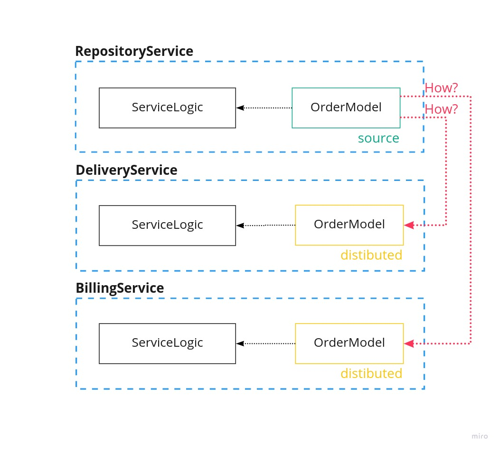

# Shared Models

**Давайте мы рассмотрим Монолитную Архитектуру:**
 - у нас единая кодовая база
 - мы объявили модели для приложения
 - мы во всём проекте можем их использовать

**Давайте мы рассмотри Сервисно-Ориентированную Архитектуру:**
 - у нас нет единой кодовой базы
 - мы объявили модели для сервиса с репозиторием
 - как нам использовать эту модель в других сервисах?

Мы распространим модели в другие сервисы с помощью менеджера пакетов. 
 В NodeJS менеджер пакетов npm - нам надо будет написать npm пакет.

Создание пакета мы добавим в pipeline.

**Порядок действий при изменением модели Order:**
1. Создать новый пакет с моделью Order
2. Добавить новую версию пакета в зависимости сервисов

Шаг №2 мы автоматизируем добавление скрипта в RepositoryService. 

**А как нам локально вести разработку при изменении модели Order?**

Создавать пакет из OrderRepository и выкачивать его в DeliveryService или BillingService не удобно.
 Это занимает много времени и не удобно в работе.

Есть утилита, которая создаёт пакет локально и устанавливает его.
 Это решение тоже не удобное - меняем модель, запускаем команду.
 Выполнение команды занимает некоторое время.
 В результате разработчик ведёт разработку не эффективным способом.

Нам для локально разработки будет удобно **моментальное применение изменений** в модели Order.
 В NodeJS можно этого достичь с помощью пакета webpack.
 Webpack при изменение в модели Order будет создавать пакет в кодовой базе DeliveryService или BillingService.

Для переключения между локальным webpack пакетом и пакетом из npm мы добавим параметр. 

Таким образом мы решим проблему Shared Models в Сервисно-Ориентированную Архитектуру и будем эффективно решать задачи, в которых требуются изменения в модели.
